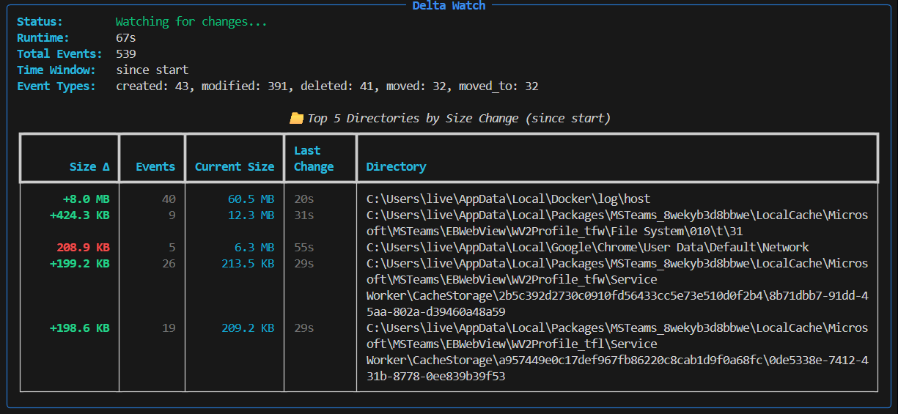

# DeltaWatch


An event-driven directory monitoring tool that tracks filesystem changes in real-time using OS-level filesystem events. DeltaWatch provides instant notifications of file and directory modifications without the need for periodic scanning.

## Features

- **Event-Driven Monitoring**: Uses native OS filesystem APIs (Windows ReadDirectoryChangesW, Linux inotify, macOS FSEvents)
- **Size Change Tracking**: Monitors and displays cumulative size changes for directories
- **Real-Time Display**: Live updating terminal interface showing changes as they happen
- **Time Window Filtering**: View changes within specific time periods
- **Pattern Exclusion**: Filter out unwanted directories using glob patterns
- **Detailed Event History**: Optional display of recent filesystem events
- **Zero CPU Overhead**: No scanning - the OS notifies us when changes occur

## Screenshot


## Requirements

- Python 3.7 or higher
- Operating System: Windows, Linux, or macOS

## Installation

### 1. Create Virtual Environment

**Windows (cmd):**
```cmd
python -m venv venv
venv\Scripts\activate
```

**Windows (PowerShell):**
```powershell
python -m venv venv
.\venv\Scripts\Activate.ps1
```

**Linux/macOS:**
```bash
python3 -m venv venv
source venv/bin/activate
```

### 2. Install Dependencies

```bash
pip install -r requirements.txt
```

The script requires:
- `rich >= 13.7` - For terminal UI and formatting
- `watchdog >= 3.0` - For filesystem event monitoring

## Usage

### Basic Usage

Watch a specific directory:
```bash
python deltawatch.py C:\Users
```

### Common Use Cases

**Monitor a directory with recent events visible:**
```bash
python deltawatch.py --show-events
```

**Watch only changes from the last 5 minutes:**
```bash
python deltawatch.py --minutes 5
```

**Recursive monitoring of all subdirectories:**
```bash
python deltawatch.py --recursive
```

**Exclude specific patterns:**
```bash
python deltawatch.py --exclude "*Docker*" --exclude "*WSL*"
```

**Show top 20 directories with fastest refresh:**
```bash
python deltawatch.py --top 20 --refresh 0.5
```

## Command Line Options

### Required Arguments

| Argument | Description | Default |
|----------|-------------|---------|
| `root` | Directory path to watch | `.` (current directory) |

### Optional Arguments

| Option | Type | Description | Default |
|--------|------|-------------|---------|
| `-m, --minutes` | integer | Time window for filtering changes in minutes. If not specified, shows all changes since start | None (all) |
| `-r, --refresh` | float | Display refresh interval in seconds | 1.0 |
| `-t, --top` | integer | Number of top directories to display | 10 |
| `--show-events` | flag | Show recent events table (hidden by default) | disabled |
| `--event-count` | integer | Number of recent events to show when --show-events is used | 20 |
| `--recursive` | flag | Watch subdirectories recursively (can be resource-intensive) | disabled |
| `--exclude` | string | Exclude paths matching pattern (can be used multiple times) | none |
| `--max-history` | integer | Maximum number of events to keep in history | 1000 |

### Examples

**Monitor Downloads folder, show last 10 minutes only:**
```bash
python deltawatch.py C:\Users\live\Downloads --minutes 10
```

**Fast refresh with events visible:**
```bash
python deltawatch.py --refresh 0.5 --show-events --event-count 30
```

**Recursive watch with exclusions:**
```bash
python deltawatch.py C:\Projects --recursive --exclude "*.git*" --exclude "*node_modules*"
```

**Monitor large directory tree with extended history:**
```bash
python deltawatch.py --recursive --max-history 5000 --top 25
```

## Display Information

### Statistics Panel

The main display shows:
- **Status**: Current monitoring state
- **Runtime**: How long the watcher has been running
- **Total Events**: Count of all filesystem events detected
- **Excluded Events**: Number of events filtered out by exclusion patterns
- **Time Window**: Current time filter being applied
- **Event Types**: Breakdown of event categories (created, modified, deleted, moved)

### Directory Changes Table

Displays directories sorted by absolute size change:
- **Size Δ**: Cumulative size change (green for increase, red for decrease)
- **Events**: Number of filesystem events in this directory
- **Current Size**: Current total size of files in the directory
- **Last Change**: Time since last modification
- **Directory**: Full path to the directory

### Recent Events Table (Optional)

When `--show-events` is enabled, shows individual filesystem events:
- **Time**: When the event occurred
- **Type**: Event category (created, deleted, modified, moved)
- **Size Δ**: Size change from this specific event
- **Path**: Full path to the affected file or directory

## How It Works

DeltaWatch uses the `watchdog` library to register filesystem event handlers with the operating system. When files or directories are created, modified, deleted, or moved, the OS immediately notifies the application through these handlers.

**Key Benefits:**
- No CPU usage when filesystem is idle
- Instant detection of changes (no polling delay)
- Accurate size delta tracking by monitoring individual file changes
- Scalable to large directory trees

## Stopping the Watcher

Press `Ctrl+C` to stop monitoring. A summary will be displayed showing:
- Total events captured
- Number of excluded events
- Directories changed
- Total runtime

## Troubleshooting

**"Error: path is not a directory"**
- Ensure the path exists and is a directory
- On Windows, wrap paths with spaces in quotes: `python deltawatch.py "C:\My Documents"`

**High CPU usage with --recursive**
- Very large directory trees can be resource-intensive
- Use `--exclude` patterns to filter out large subdirectories
- Consider watching a more specific subdirectory

**Permission errors**
- Some system directories require administrator privileges
- Run with elevated permissions or choose a different directory

**Events not appearing**
- Verify the path is correct
- Check if exclusion patterns are too broad
- Try without `--minutes` to see all historical events

## License

This script is provided as-is for monitoring filesystem changes.

## Development

### Running Tests

The project includes a comprehensive test suite using pytest. To run the tests:

```bash
# Run all tests
pytest tests/ -v

# Run tests with coverage report
pytest tests/ --cov=deltawatch --cov-report=term-missing

# Run tests with HTML coverage report
pytest tests/ --cov=deltawatch --cov-report=html
```

### Continuous Integration

The project uses GitHub Actions to automatically run tests on:
- **Python versions**: 3.8, 3.9, 3.10, 3.11, 3.12
- **Operating systems**: Ubuntu, Windows, macOS

Tests run automatically on push to main/develop branches and on pull requests.

### Test Coverage

Current test coverage includes:
- Helper functions (`human_bytes`, `get_dir_size`)
- `DirectoryChangeTracker` class functionality
- Event handling (create, modify, delete, move)
- Size delta calculations
- Time-based filtering
- Exclusion patterns
- Integration tests with real filesystem events

